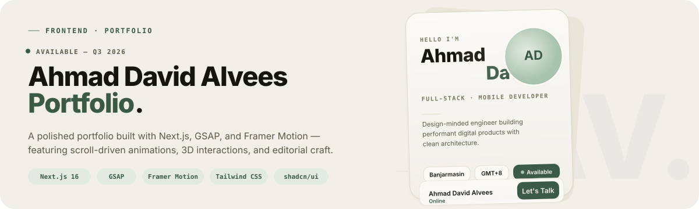

<p align="center">
  
</p>

<p align="center">
  
  
  
  
  
  
</p>

---

A personal portfolio that treats every interaction as a design opportunity. Scroll-driven reveals, 3D card flips, mouse-follow tilt, and a lo-fi music player — all running on a modern Next.js stack.

**[View live](https://adrianvale.dev)** · **[Case study](mailto:hello@adrianvale.dev)**

## Proof

The portfolio makes heavy use of scroll-triggered animation, 3D transforms, and motion design without sacrificing performance:

| | |
|---|---|
| **3D Profile Card** | `flip-to-back` with reactive spring physics, mouse-follow parallax, cursor-driven reflection sweep — composed into a single CSS transform for cross-browser `preserve-3d` reliability. |
| **Service Cards** | Border-glow mesh gradient that follows the cursor position in real time using conic-gradient masking and pointer tracking. |
| **Scroll Choreography** | Every section has its own entrance: clip-path reveals for projects, elastic scale for stats, alternating slide-and-tilt for testimonials, scrub-driven parallax for hero and footer watermarks. |
| **Text Splitting** | GSAP `SplitText` drives per-character reveals on section titles with ScrollTrigger synchronization. |
| **Smooth Scrolling** | Lenis powers the scroll engine with GSAP's ScrollTrigger wired in, keeping scrub and mouse-follow calculations in sync. |
| **Reduced Motion** | Every animation — GSAP, Framer Motion, and CSS — respects `prefers-reduced-motion: reduce`, including the hero parallax, entrance staggers, and continuous decorative loops. |
| **Design Tokens** | A warm-paper-and-pine palette (`--bg: #F1EFE8`, `--accent: #3A5A46`, `--ink: #16140E`) expressed as CSS custom properties, mapped to shadcn's theme variables for compatibility. |

## Stack

| Layer | Choice |
|---|---|
| **Framework** | [Next.js 16](https://nextjs.org) (Turbopack, App Router) |
| **Animation** | [GSAP](https://gsap.com) (`ScrollTrigger`, `SplitText`, `useGSAP`) + [Framer Motion](https://motion.dev) (spring physics, 3D transforms) |
| **Styling** | [Tailwind CSS v4](https://tailwindcss.com) + CSS custom properties |
| **UI Primitives** | [shadcn/ui](https://ui.shadcn.com) (adapted via custom tokens) |
| **Fonts** | Plus Jakarta Sans (headings), Inter (body), Space Mono (mono) |
| **Scroll Engine** | [Lenis](https://lenis.studiofreight.com) |
| **Icons** | [Lucide](https://lucide.dev) |
| **Package Manager** | [bun](https://bun.sh) |
| **Runtime** | Node.js 20+ |

## Getting Started

```bash
git clone https://github.com/yourusername/portfolio.git
cd portfolio
bun install
bun dev
```

Open [http://localhost:3000](http://localhost:3000) — the portfolio runs on Turbopack for fast iteration.

### Commands

| Command | Purpose |
|---|---|
| `bun dev` | Start development server (Turbopack) |
| `bun run build` | Production build |
| `bun start` | Serve production build |
| `bun run lint` | Lint with ESLint |

## Structure

```
.
├── app/
│   ├── globals.css      # Design tokens, base styles, all section CSS
│   ├── layout.tsx        # Root layout (fonts, Lenis, skip link)
│   └── page.tsx          # Home page composition
├── components/
│   ├── ui/               # shadcn primitives (badge, button, card, avatar)
│   ├── Hero.tsx          # Hero with GSAP word stagger + scroll parallax
│   ├── ProfileCard.tsx   # 3D flip card with motion spring transforms
│   ├── CardFront.tsx     # Front face: greeting, name, status chips
│   ├── CardBack.tsx      # Back face: skills, quote, social links
│   ├── Services.tsx      # Service cards with cursor-follow border glow
│   ├── Projects.tsx      # Project grid with clip-path reveals
│   ├── Testimonials.tsx  # Auto-scrolling marquee with tilt on hover
│   ├── Stats.tsx         # Animated count-up on scroll
│   ├── Header.tsx        # Fixed header with scroll-aware glass effect
│   ├── Footer.tsx        # Contact CTA, socials, live time
│   ├── MusicPlayer.tsx   # Lo-fi player with EQ animation
│   ├── Stack.tsx         # Tech stack chips
│   ├── Skills.tsx        # Categorized capabilities list
│   ├── TiltedCard.tsx    # Configurable 3D tilt image card
│   ├── BorderGlow.tsx    # Cursor-follow mesh gradient border
│   ├── SpecularButton.tsx # WebGL specular highlight button
│   ├── Toast.tsx         # GSAP-animated toast notifications
│   ├── LenisProvider.tsx # Smooth scroll injection
│   └── RevealProvider.tsx# IntersectionObserver + GSAP animation orchestrator
├── hooks/
│   ├── useInView.ts      # IntersectionObserver with count-up trigger
│   ├── useReveal.ts      # Scroll-triggered fade-up via data-reveal
│   ├── useScrollSpy.ts   # Active section tracking
│   └── useSectionAnimations.ts  # Per-section GSAP + ScrollTrigger
└── public/
    └── font/             # Self-hosted fonts (Plus Jakarta Sans, Inter, Space Mono)
```

## Design

### Palette

```css
--bg: #F1EFE8          /* Warm paper */
--surface: #FBFAF5      /* Slightly lighter card surface */
--ink: #16140E          /* Near-black text */
--accent: #3A5A46       /* Deep pine */
--accent-tint: #E3EAE2  /* Accent at 10% */
--text-2: #5D5847       /* Body text */
--text-3: #7C7660       /* Metadata */
```

### Typography

- **Headings:** Plus Jakarta Sans — 800 weight, tight letter-spacing, `clamp()` scales
- **Body:** Inter — 400/600 weight, 1.6 line-height
- **Code/Mono:** Space Mono — used for eyebrow labels, tags, timestamps, and stats suffixes

### Motion Philosophy

- Easing follows a single `cubic-bezier(0.22, 1, 0.36, 1)` — exponential deceleration
- Each section has a distinct entrance treatment (not the same fade-up repeated)
- Continuous animations (EQ bars, pulse dots) use `sine.inOut` for natural breathing
- Reduced motion fully supported — animations skip, scroll-behavior resets, marquee collapses to scroll

## License

MIT — see [LICENSE](LICENSE) for details.

---

<p align="center">
  <sub>Designed &amp; built with intent by Ahmad David Alvees.</sub>
</p>
